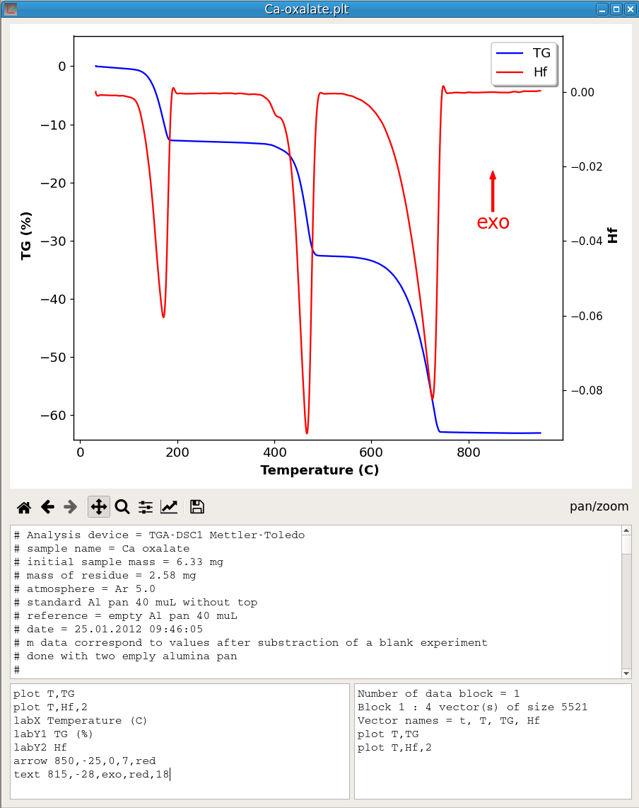

*pyDataVis* is an open source software written in pure [Python](https://en.wikipedia.org/wiki/Python_(programming_language)). Thus it can run on Windows, Linux/Unix and macOS.

There are many [free plotting sofware](https://en.wikipedia.org/wiki/Category:Free_plotting_software) most of them far more powerful than *pyDataVis*. However, in terms of simplicity, it is hard to beat. Indeed it is very easy to use, just drag and drop your data file in *pyDataVis* window and immediately you are seeing the curves. For now, *pyDataVis* is limited to 2D plotting.

- [User Guide](pyDataVis.html)
- [Features](Features.md)
- [Screenshots](Screenshots.html)
- [Downloads](Downloads.html)

