# Overview

**pyDataVis** is a GUI application for interactive visualization, analysis and manipulation of scientific data. There are many [free plotting sofware](https://en.wikipedia.org/wiki/Category:Free_plotting_software) most of them far more powerful than *pyDataVis*. However, in terms of simplicity, it is hard to beat. Indeed it is very easy to use, just drag and drop your data file in *pyDataVis* window and immediately you are seeing the curves. For now, *pyDataVis* is limited to 2D plotting.

*pyDataVis* is an open source software written in [Python](https://en.wikipedia.org/wiki/Python_(programming_language)). It uses [PyQt](https://riverbankcomputing.com/software/pyqt/) as graphic user interface (GUI) and [Matplotlib](https://matplotlib.org/) for plotting.

*pyDataVis* operates only on text data. These data are assumed to be in columns with the same number of elements. The column separator (a space, a tab character, a comma, a semicolon ...) must be the same all over the file. Each column is regarded as a **vector** (one-dimensional array). Here is an example, with 3 vectors having 10 elements:

```
0	0.00	0.00
1	1.00	1.00
2	1.41	1.69
3	1.73	2.09
4	2.00	2.38
5	2.23	2.60
6	2.44	2.79
7	2.64	2.94
8	2.82	3.07
9	3.00	3.19
```

This set of data in tabular form is called a **data block**. It is possible to have several data blocks with different number of columns (vectors). These blocks must be separated by, at least, two empty lines.

Any line which contains non numeric data will be regarded as a comment. However, to prevent ambiguity, it is wiser to prefix a comment line with a '#' character.

A pyDataVis window is shown in figure 1; it is divided into four main parts:

- The upper part, which contains the *Plotting area*. 
- Below the *Plotting area*, there is the *Text editor window* showing the text data.
- At the bottom, the remaining space is shared by the *Script window* on the left and
- the *Information window* on the right.
- At the bottom, is the *Information window*.
Besides, just below the *Plotting area*, there is the [MatPlotLib toolbar](#matplotlib-toolbar).
  
When a data file is red without error, the *Text editor window* shows the text content of the file. If the format of this text has been correctly decoded, one or more curves are automatically plotted in the *Plotting area*. Information about the structure of the data and plotted curves are given in the *Information window*. Unlike text editor and script windows the text in *Information window* cannot be modified, it is purely informational. The *Script window* is used to input the [script commands](#script-commands). 

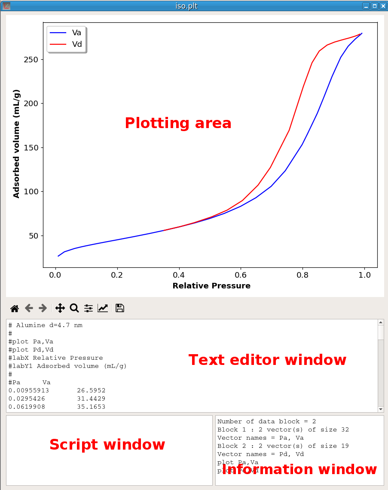{width=600px}


# Installation

pyDataVis requires Python 3, PyQt5, Numpy, Pandas, Scipy and Matplotlib. The easiest way to install everything is to use Open Source [Anaconda](https://www.anaconda.com/products/individual) that will "just work" out of the box for Windows, macOS and common Linux platforms.

Then open a Terminal and change the current working directory to the location where you want to copy the pyDataVis folder, for example ~/programs:
```
cd ~/program
```
Then type:
```
git clone https://github.com/PierreAlphonse/pyDataVis.git
```


## Usage

Change the current working directory to the pyDataVis folder:
```
cd ~/programs/pyDataVis
```
and execute the pyDataVis.py script:
```
python pyDataVis.py
```

**Examples**

The folder *examples* contains files for testing almost any function. Instructions are given in the readme.txt file and a picture file (.png) shows the Plotting area at the end of the process.


# Loading data in pyDataVis

The text data is always loaded in the *Text editor window* before been processed. There are two ways to supply data in the *Text editor window*:

- The usual way is to load the data from a file. This is done either by selecting *Open* in the *File* menu or by dragging the file, from the file manager or the desktop, in the pyDataVis window.

- The second way is to enter the data manually. For example, using the key sequence Ctrl+N (or selecting *New* in the *File* menu) opens a new empty pyDataVis window. You may then input the data in the Text editor window. It is also possible to paste text data from an other application. Translation of this data in vectors and plotting the resulting curves is done by selecting *Update from text* in *File* menu.


## Reading spectra in JCAMP-DX format

pyDataVis can automatically decode and plot the files containing infrared spectra and mass spectra in [JCAMP-DX format](http://www.jcamp-dx.org/protocols.html). This format is used in [NIST Chemistry WebBook](https://webbook.nist.gov/chemistry/) database.
pyDataVis also recognizes the Raman data file from the [RRUFF](https://rruff.info/) database.

## Append

The *Append* option in the *File* menu is used to append data from another file at the end of the current data. The added file must contain only one data block and the number of vectors must be the same as the current data block.

## Importing data

By using the option *Import from spreadsheet* in the *File* menu, it is possible to import data from spreadsheet files like MS Excel or LibreOffice Calc (in this case the odfpy module must first be installed, for example with ```pip install odfpy```). If the file contains several sheets, the same number of data blocks are created. Each sheet must contains only one data table otherwise the importation will give unpredictable results.

## Updating 

When the vectors are modified, for example by [Script commands](#script-commands), the Text editor window is not updated to reflect these changes. In case of mistake this gives the possibility to restore previous state by using the *Update from text* option in the *File* menu. To update the Text editor window with the current vector values the *Update from data* option in the *File* menu should be used. Beware that these two options update also the file so that there is no way to get the original data back.

## Data table

To see the real-time values of the vector elements, use the *Data Table* option in the *Tools* menu. This table can also be displayed with the key sequence Ctrl+T. The position of the selected cell of this table is linked to the [data cursor](#cursor-and-marks) position. The value of the vector elements can also be modified with this table.


# Saving and exporting data

The data blocks can be saved in text files by using the options *Save data* and *Save data As* in the *File* menu. The column separator is always a tab character. The data blocks are separated from each other by two successive empty lines. *Save data* uses the current file name whereas *Save data As* lets you choose a new file name.
I recommend to use the ".plt" extension for files saved by *pyDataVis* to tell them apart from simple .txt files because they contains plotting commands in the header.

There are three options in the *File* menu to export the data blocks:

- *Export to Excel* allows to export to a MS Excel file. Each data block is saved in a separated data sheet.
- *Export to CSV* can be used to export the data as CSV (Comma Separed Value). Each data block is saved to a separate file. 
- *Export to Veusz* can be a way to produce publication quality charts by exporting the curves to the nice [Veusz](https://veusz.github.io/) software.


# Plotting curves

## Plot commands and vector names

Non numeric lines are generally regarded as comments and are not decoded except if they start with special words like plot, labX, ... in which case they are interpreted as plot commands. Besides, the line immediately before the numerical data is decoded to check if it contains the vector names. For example:

```
Time Intensity
0     0
1     5
2     15
3     30
```

The first vector [0,1,2,3] will be named *Time* and the second one [0,5,15,30] *Intensity*. 

The number of items in the line containing the vector names must match the number of columns. Therefore a vector name cannot contains space because the space character is regarded as a separator (underscore can be used instead).

In the absence of a line containing the vector names, the vectors are named automatically as V1B1, V2B1, ... where the B1 ending indicates that these vectors belong to the first data block. Thus if the file contains a second data block the vectors belonging to this block will be named V1B2, V2B2, ...

If no plot command is found in the file header, the first column (V1B1) is assumed to contain X values. Thus, if the file contains three columns (vectors), V1B1, V2B1 and V3B1, two curves will be plotted automatically, V2B1 against V1B1 and V3B2 against V1B1.

Several pyDataVis windows can be opened at the same time and curves exchanged between them using the options of the *Curve* menu or keyboard shortcuts.


## Curves

A curve consists of a set of two vectors (X and Y). Thanks to the *Curves* menu, the curves can be deleted, duplicated or copied. A curve copied in a pyDataVis window cannot be pasted in the same window because two curves cannot share the same name. If the curve is pasted in a window containing a vector having the same name, the original name is suffixed with the ''#'' character. It is the same when a curve is duplicated,

When a X,Y curve is pasted into another window, if the same X-vector already exists in a data block there are two possibilities, either to add the Y-vector at the end of the data block or to create a new data block to store the X and Y vectors. This is left to the choice of the user.

The *Save in file* option allows for saving a given curve in a new file.


## Cursor and marks

When a curve is displayed on plotting area, right clicking with the mouse in this area triggers a light brown crosshair cursor. The point number (no) and coordinates (xc, yc) at the cursor position are shown in the status bar at the bottom of the pyDataVis window.

This cursor can be moved to the next data point either with the key sequence Ctrl+Right arrow or by selecting the option *Cursor Right* in the *Marks* menu. Similarly the cursor can be moved to the previous data point either with the key sequence Ctrl+Left arrow or by selecting the option *Cursor Left* in the *Marks* menu.

Besides, the key sequence Ctrl+F (*Cursor First* in the Marks menu) puts the cursor on the first point while the key sequence Ctrl+L (*Cursor Last* in the Marks menu) puts the cursor on the last point.

When the plotting area shows several data curves, the cursor follows only one curve, which coordinates are shown in the status bar. This is the "active" curve. The key sequence Ctrl+D (*Cursor Down* in the Marks menu) makes the previous curve to become the active one whereas the key sequence Ctrl+U (*Cursor Up* in the Marks menu) makes the previous curve to become the active one.

Finally, the key sequence Ctrl+M (*Add a Mark* in the Marks menu) adds or moves a mark (shown as a gray vertical line) at the cursor position. Only two marks can be added because the third time Ctrl+M is hit, the first mark is deleted and replaced by the new one. The key sequence Ctrl+R (*Remove all Marks* in the Marks menu) remove cursor and marks. These marks are used to select portions of the curve for several [script commands](#script-commands).


## Matplotlib toolbar

Beneath the *Plotting area* there is the [MatPlotLib toolbar](https://matplotlib.org/3.1.1/users/navigation_toolbar.html) shown in figure 2. Hovering the mouse over each icon displays a tool tip giving a short description of its action.
Here is the description of the action of each button:

- The first three buttons, Home, Back/Forward, are used to navigate through the previous views. Home returns to the initial view of the plot.

- The fourth button has two modes: pan and zoom. Press the left mouse button and hold it to pan the figure. If you press 'x' or 'y' while panning the motion will be constrained to the x or y axis, respectively. Press the right mouse button to zoom, dragging it to a new position. The x axis will be zoomed in proportionately to the rightward movement and zoomed out proportionately to the leftward movement. The same is true for the y axis and up/down motions.

- The fifth button handles zooming to rectangle functions. Dragging the mouse while holding the left button the axes view limits will be zoomed in to the defined region. When using the right mouse button, the axes view limits will be zoomed out, placing the original axes in the defined region.

- The sixth button is used to adjust the plot position within the window.

- The seventh button calls the axis/curve style editor, where you can modify most of the plot properties like title, axis label and scale, plot symbols, line colours and line styles. It should be noted that the changes done using the axis/curve style editor are not recorded permanently.

- The last button allows to save the plot as an image. You can save files with the following extensions: png, ps, eps, svg and pdf.

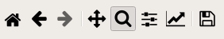{width=300px}


## Matplotlib keyboard shorcuts

| Command                           | Keyboard shortcut
|:----------------------------------|:---------------------------------------
| Toggle grid                       | g or G when mouse is over the plot
| Toggle x axis scale (log/linear) &nbsp; | L or k when mouse is over the plot
| Toggle y axis scale (log/linear)  | l when mouse is over the plot
| Constrain pan/zoom to x axis      | hold x when panning/zooming with mouse
| Constrain pan/zoom to y axis      | hold y when panning/zooming with mouse
| Preserve aspect ratio             | hold CONTROL when panning/zooming with mouse

The toggle grid shortcut g (or G) behavior is: the first hit toogles vertical grid, the second hit adds the horizontal grid, the third hit removes the vertical grid leaving only the horizontal one and the fourth hit removes all grids.


# Data conversion

When the data format cannot be decoded, no curve is shown in the Plotting area, only the text content is displayed in the Text editor window. Nevertheless, in some cases, the data in the Text editor window can be processed by selecting the suitable option in the *Convert* menu. 


## CIF

The **CIF** option is used to generate a powder diffraction pattern from a Crystallographic Information File (CIF). This is a standard text file format for representing crystallographic information, promulgated by the International Union of Crystallography [(IUCr)](https://www.iucr.org/). A large collection of CIF files can be found in the Crystallography Open Database [(COD)](http://www.crystallography.net/cod/).

The reflection lines in the simulated XRD pattern are generated from CIF data loaded in the *Text editor window* by the [Dans_Diffraction package](https://pypi.org/project/Dans-Diffraction/). This package is easily installed in aterminal with: ```pip install Dans-Diffraction```.

The line positions are calculated for an X-ray energy = 8.048 keV, which corresponds to Cu K-alpha-1 radiation. For example, the figure 3 shows the simulated pattern of silicon calculated from a CIF file (COD 9008566) plotted along with an experimental pattern recorded with a silicon standard.

{width=600px}


## DAT

The **DAT** option does the conversion of ".DAT" diffraction file format. This is a common ASCII file format for raw (profile) data. In the first line, the 2theta start, step and final value are given, followed by the intensity values for each step. The number of intensity values per line may vary.
The generated data is saved in a new file using the same name as the ".DAT" file but with ".TXT" extension. Then this file is loaded and plotted in a new *pyDataVis* window.


## PRF

The **PRF**  option does the conversion of a ".prf" file generated by [FullProf](https://www.ill.eu/sites/fullprof/index.html) in a tabular text file. FullProf is a set of programs used for Rietveld analysis of X-ray powder diffraction data. The generated data is saved in a new file using the same name as the ".PRF" file but with ".TXT" extension. Then this file is loaded and plotted as shown in figure 4.

{width=600px}


## Reshape

The **Reshape** option allows to change the shape of a data block (number of lines and columns) while keeping the total number of elements constant. For example, *Reshape* can transform 1D data in 2D with half the number of elements in each dimension.
It can be used to restore the right shape which has been lost after pasting the data from another application.
For example, when a set of cells are pasted from [LibreOffice Calc](https://www.libreoffice.org/discover/calc/) the column separator seems to have vanished. By using the *Update from text* option in the *File* menu, the data are now in one column. With the *Reshape* option it is possible to restore the original shape of the data.


## Transpose

The **Transpose** option switches the rows and columns. Like *Reshape*, it can be used to restore the right shape which has been lost after pasting the data from another application.


## 1D->2D
The **1D->2D** option adds to a data block containing only one vector, let's call it Y, a new vector X thereby allowing to plot Y=f(X). The X vector contains the point number, starting from 0.
Subsequently it is easy to modify X thanks to [script commands](#scalar-operations-on-a-vector).


# Interactive tools

In pyDataVis, most of the data processing is done via [scripting commands](#script-commands) which are detailed below. However in some cases it is more convenient to use interactive tools. These tools are accessed via the *Tools* menu. When several curves are plotted in the Plotting area, a dialog let you select the curve that need to be addressed.

In some cases the computation results are saved in the log file preceded by a header indicating the date and time of the calculation. This file can be accessed and modified by selecting the *View log* option in the file menu.


## Smoothing

Smoothing is a very powerful technique used all across data analysis. It consists of removing random variation (noise) while preserving the original shape and features of the signal. With *pyDataVis* you can choose several techniques to achieve the best result according to the kind of data.

With the **Smoothing** option of the *Tools* menu two kinds of filter are proposed: the *Moving average* and the *Savitzky-Golay*. 

The [**Moving average**](https://en.wikipedia.org/wiki/Moving_average) filter operates by averaging 'n' points from the input data to produce each point in the output data, where n is an odd integer. The figure 4 shows the smoothing window when the Moving average filter is selected. Three curves are plotted. The grey curve corresponds to the original data, the blue curve to the filtered data and the green curve shows the difference between original and filtered. The goal is that this curve shows only noise.

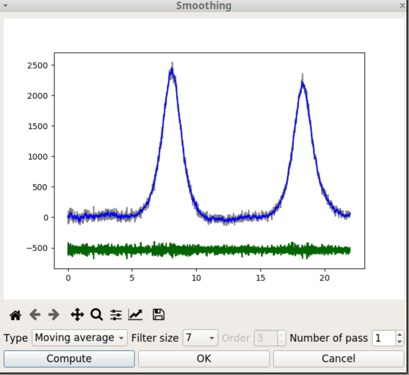{width=500px}

There are two parameters to tune the degree of smoothing. The first is the filter size, which is the number of points that are averaged. The second is the number of passes which is the number of times the filtering process is repeated. When the parameter values are changed, you should click on the *Compute* button to restart the calculations with the new values.

When you click on the *OK* button, the original data is replaced by the blue curve, the window is closed and the Plotting area is updated.

The [**Savitzky-Golay**](https://en.wikipedia.org/wiki/Savitzky%E2%80%93Golay_filter) is a low-pass filter, particularly suited for smoothing noisy data. The main idea behind this approach is to make for each point a least-square fit with a polynomial of low order over an odd-sized window centered at the point. It has the advantage of preserving the original shape and features of the signal better than other types of filtering approaches, such as moving average.

When the Savitzky-Golay filter is selected, there is an additional parameter, the order, which is the degree of the fitting polynom.


## Spline Smoothing

**Spline** functions are widely used in applications requiring data interpolation and/or smoothing. They are build by defining knot points and calculating the polynomials that pass through these points. With the **Spline Smoothing** option of the *Tools* menu two parameters are used to tune the level of smoothing: 

- The degree of the polynomials. Must be in the range 1 to 5. The best starting value is 3, which corresponds to a cubic spline.

- The smoothing factor, s, which is used to choose the number of knots. This factor control the trade-off between fidelity to the data and roughness of the function estimate. If s = 0, spline will interpolate through all data points.

The figure 6 shows the *Spline smoothing* window. Like with the *Smoothing* window seen above, three curves are plotted. The grey curve corresponds to the experimental data, the blue curve to the smoothed data and the green curve to the difference between experimental and smoothed values.

{width=500px}


## ALS Smoothing

The *ALS Smoothing* option, in the *Tools* menu, is primarily used for baseline correction. ALS stands for Asymmetric Least Squares. This method has been designed by Paul Eilers and Hans F.M. Boelens (2005). To get an effective baseline estimator, it combines a smoother with asymmetric weighting of deviations from the (smooth) trend. It is easy to use, fast and keeps the analytical peak signal intact. No prior information about peak shapes or baseline (polynomial) is needed. 

There are two parameters: p for asymmetry and lambda for smoothness. For a signal with positive peaks a good  choice is to set lambda between 10<sup>2</sup> and 10<sup>9</sup> and p between 0.001 and 0.1.

It is not efficient for a number of data point exceeding 1000.

The figure 7 shows the ALS Smoothing window. Besides the *Compute* button already present in the previous tools, there are two additional buttons. As we might expect *Subtract* will subtract the baseline and thus change the original data, whereas *Add* does not change the data but add a new vector containing the baseline.

{width=500px}


## Curve Fitting

The *Curve Fitting* option, in the *Tools* menu, is used for fitting curves with predefined models. There are seven models :

- Polynomial

- Exponential, $y = A \times exp(B x)$

- Logarithm, $y = A \times Ln(x) + B$

- Power, $y = A \times x^B$

- Sigmoid, $y = y_0 + \frac{H}{1 + exp(S (x_0 - x))}$

- Arrhenius,  $y = A \times exp \left( - \frac{E}{R(x+T)} \right)$  with R = 8.314 and T = 273

- Herschel-Bulkley, $y = A + B x^C$

Several curves are plotted in figure 8 to show the general shape of these models. In the plot legend, Bneg means that B is negative and Bpos that B is positive. Thus pow_Bneg reads as power model with negative B.

In the equation of the sigmoid model, $x_0$ is the position of the inflection point, $y_0$ is the position of the baseline, H is the height (amplitude) and S governs the slope of the tangent at the inflection point. Larger S values means steeper increase. When S is negative the S shape is inverted. For example, in figure 8, S = -1 and in figure 9, S = +1.

{width=550px}

The last two models are more specific. The [Arrhenius](https://en.wikipedia.org/wiki/Arrhenius_equation) model describes the temperature dependence of reaction rates. The parameters are A (which is called the pre-exponential factor) and E the activation energy.

The [Herschel-Bulkley](https://en.wikipedia.org/wiki/Herschel%E2%80%93Bulkley_fluid) model is used to describe the rheological behavior of a non-newtonian fluid; y is the shear stress and x the shear rate; A is the yield stress, B the consistency index and C the flow index.


None of the available models in *Curve Fitting* menu option are adequate for fitting peaks. For that, the [*Peak fitting*](#peak-finding-and-peak-fitting) tool should be used.

The figure 9 shows the Curve Fitting window after a fitting process with the Sigmoid model. The current parameter values are printed in the text area, below the Matplotlib graphic toolbar. The value of these parameters can be modified in the fields at the bottom of the window and the fitting process is restarted by clicking on the *Compute* button. An estimation of the goodness of the fit is given through the Root Mean Square Error (RMSE) value defined by:

$$ RMSE = \sqrt \frac {\sum_{i=1}^{N} { \left[ y_{calc} - y_{exp} \right] ^2 } } {N} $$

where $y_{calc}$ is the calculated data, $y_{exp}$ the experimental data and N the number of points. The fitting results are saved in the log file.

When you click on the *OK* button, the original data is replaced by the blue curve, the window is closed and the Plotting area is updated.

{width=500px}


## Peak finding and Peak fitting

These two options of *Tools* menu are working together because after finding the peaks, the *Peak finding* module automatically calls the *Peak fitting* module.

Selecting the *Peak finding* option pops up the Peak finding dialog as shown on figure 10. When the signal is noisy there are a very large number of peaks. To select only the relevant ones two parameters are used: the height of the smallest peak (minHeight) and the width of the narrowest peak (minWidth). 

{width=500px}

The first time, pyDataVis try to guess the parameter values based on a statistic analysis of the signal. Of course, you can modify these values according to your expectations.

As shown on figure 11, at the end of the peak finding process, a dialog pops up to inform you of the number of peaks that were found. If you answer 'Yes' the peak fitting module is launched. Otherwise the process is canceled. 

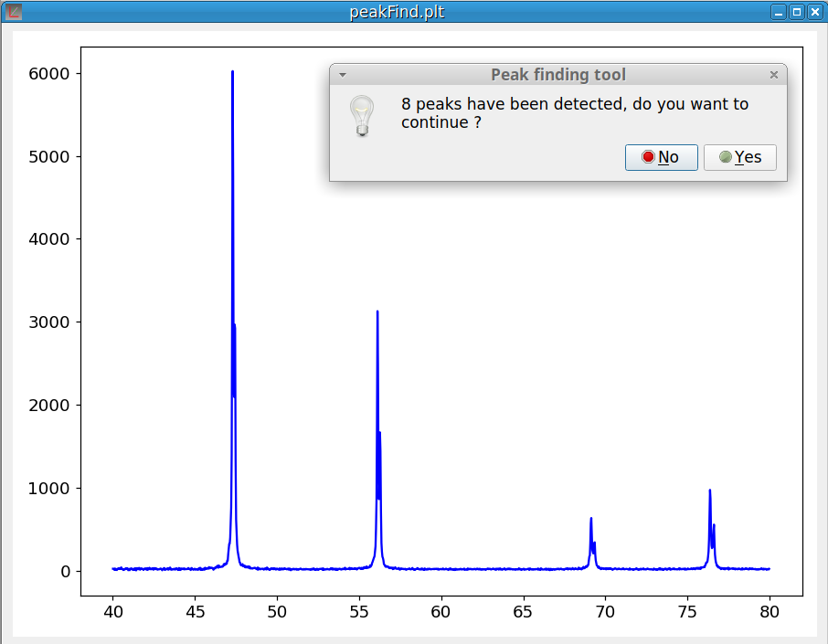{width=500px}

When the peak fitting process is finished (which can takes some time when there are many peaks) the peak fitting window pops up, as shown in figure 12. This window is divided in three parts. Above is the plotting area which allows to visually evaluate the fitting results. The grey curve corresponds to the experimental data, the blue curve to the calculated sum of the peaks and the green curve shows the difference between the data and the peak sum. Of course the goal is to make this curve as flat as possible.

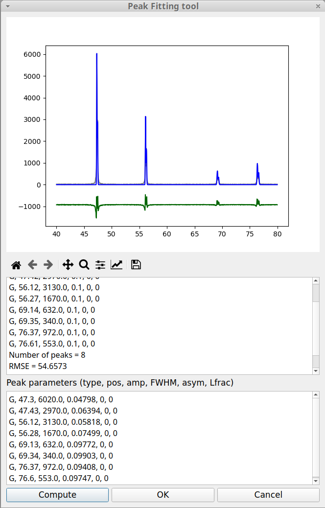{width=500px}

Below the plotting area, the results of the fitting process are shown in an  information area (read only). As in the case of [*Curve fitting*](#curve-fitting) an estimation of the goodness of the fit is given through the RMSE value, already defined above in the [*Curve fitting*](#curve-fitting) tool.
Below the text information area is the Peak parameters area. Here, the value of the peak parameters can be modified after which the fitting process can be launched again by clicking on the *Compute* button. The fitting results are saved in the log file.

When the fitting module is called from the *Finding peak* option, it uses a Gaussian function to model each peak shape. It is clear that the Gaussian type is not well suited to represent the peak shapes in the case of the experimental data shown in the previous figure. It is possible to change the peak model by replacing the peak parameters, G, by another type. pyDataVis allows to choose between six peak types:

- G  : Gaussian
- L  : Lorentzian
- P  : Pseudo-Voigt
- AG : Asymmetric Gaussian
- AL : Asymmetric Lorentzian
- AP : Asymmetric Pseudo-Voigt

The curve equation for Gaussian and Lorentzian peak type are:
$$ G(x) = A \times exp \left[- \left( \frac{x-x_m}{w} \right) ^2 \right] $$

$$ L(x) = A \times \left[ \frac{1}{1 + \left( \frac{x - x_m}{w/2} \right) ^2} \right] $$

In these equations, A is the peak amplitude (height), $x_m$ is the position of the peak maximum, w is the Full Width at Half Maximum (FWHM). The pseudo-Voigt model P(x) is a linear combination of a Gaussian curve G(x) and a Lorentzian curve L(x). Therefore this model requires an additional parameter m.

$$ P(x) = m \times L(x) + (1-m) \times G(x) \qquad with \; 0 \leq m \leq 1 $$

The peak shape, associated with these three models, is shown in the left plot of figure 13. The three remaining peak types are used to fit asymmetric peaks. In this case the w parameter is no more a constant but becomes a function of x, w(x) defined by:

$$ w(x) = \frac{2 \ FWHM}{1 + exp(a(x - x_m))} \qquad with \ -1 \leq a \leq 1 $$

The parameter a is the skewness factor. The equation of AG(x), AL(x) and AP(x) are obtained by replacing w by w(x) in the above equations of G(x), L(x) and AP(x). The peak shape corresponding to these three models is shown in the right plot of figure 13.

{width=600px}

It is important to notice that, in the peak parameter area, for each peak, six parameters are always provided even when they are not relevant, in which case they are set to zero. Besides, unlike the other, the a and b parameters can correspond to different things according to the peak type. For example, a, corresponds to the mixing parameter (m) for pseudo-Voigt model and to the skewness factor (a) for asymmetric Gaussian model.

Let us return to the peak fitting window and replace, for both peaks, the peak type parameter, G, by AP. We do not modify the other parameters and click on *Compute* button. The figure 14 shows that this fairly improves the fitting result.

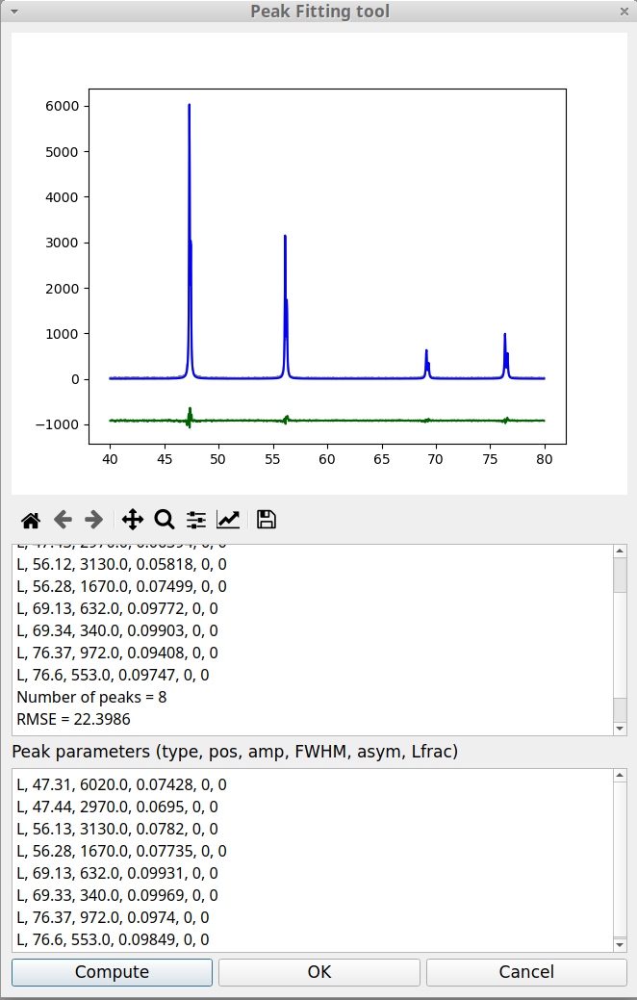{width=500px}

Clicking on *OK* generates a file named "peakFit.txt" and opens a new pyDataVis window to display its content. The plotting area is shown in figure 15. There are four curves: the experimental data, the sum of peaks and the curve for each peak.

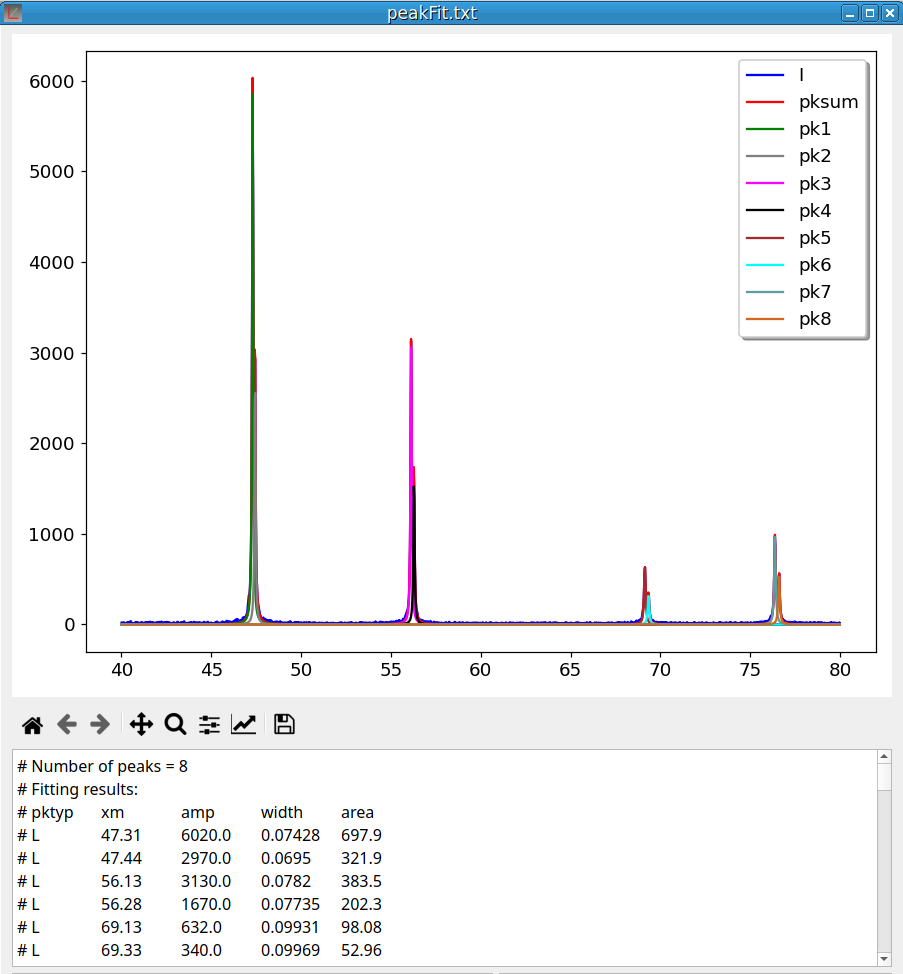{width=500px}


## Interpolation
Interpolation consists of finding intermediate values of a variable from a discrete set of its known values. For example, a spatial interpolation or temporal interpolation can be used for finding missing data in space- or time-series. 
pyDataVis use a smooth spline curve approximation to determine the positions of the unknown values. The Interpolation window, shown on figure 16, is accessed thanks to the *Interpolation* option of the *Tools* menu. There are three parameters:

- dx, which is the distance between points on abscissa.
- k, is the degree of the spline fit (1 <= k <= 5). It is recommended to use cubic splines (k=3). Even values of k should be avoided especially with small s values.
- s, the smoothing parameter, used to control the tradeoff between closeness and smoothness of fit. Larger s means more smoothing while smaller values of s indicate less smoothing.

It is possible to interpolate curves which are in another data block by selecting the corresponding block number.

It should be noticed that this tool can also be used to decrease the number of data points.

{width=500px}


## Baseline
The Baseline correction is ubiquitous for spectroscopic data analysis because a spectrometer usually have a baseline drift due to environmental factors (temperature, light source, ...).
The Baseline correction tool of pyDataVis, shown on figure 17, is accessed thanks to the *Baseline* option of the *Tools* menu. You define the baseline position by clicking on the curve. Left click adds a new point at the mouse position, right click deletes the point which was already around.
The baseline curve can be build from these points by two methods according to the type:

- Linear, the curve is build by concatenation of the line segments connecting the points;
- Cubic spine, the curve is build by cubic spine interpolation between the points.

Once a method is chosen, it is not possible to change it. If you click on *Correct* button the baseline is subtracted from the original data. If you click on *Add BL* button, this does not change the data but a new vector containing the baseline is added to the data block.

If the signal is noisy it is recommended to remove the noise prior to the baseline correction.

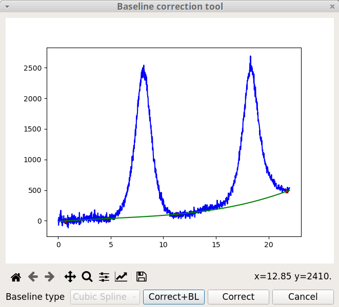{width=500px}


## Add noise
The *Add Noise* tool of pyDataVis, shown on figure 18, is accessed thanks to the *Add Noise* option of the *Tools* menu. This tool adds to the selected curve random values calculated from a normal (Gaussian) distribution. There are two parameters:

- Location, which is the mean (centre) of the distribution. It defaults to 0.0, that is the noise is uniformly distributed on both sides of the curve.
- Scale, which is the standard deviation (spread or “width”) of the distribution. Must be non-negative. The initial value given by pyDataVis is 1/100 of data span.

{width=500px}


## Remove noise
The *Remove Noise* tool of pyDataVis, shown on figure 19, is accessed thanks to the *Remove Noise* option of the *Tools* menu. Actually this tool is not interactive because the process is fully automatic.

{width=500px}


# Script commands
In pyDataVis, script commands are used for plotting and to do most of the data processing. Beware that the command names, the vector names and the parameters are case sensitive. Several script commands can be chained together.
The script commands are written in the *Script window* and executed by typing Ctrl+E or by selecting the option *Execute a script* in the Script menu. Empty lines and lines starting with # are ignored during execution. The script can be executed repeatedly by retyping Ctrl+E as often as desired. If an error occurs during the execution of a script sequence, the process is stopped at the faulty line; the remaining commands are not executed.

Before a script was executed the current data is saved in memory. If something wrong happens during execution the previous state can be restored by selecting the *Undo* option in the *Script* menu.

The key sequence *Ctrl+K* clears the text in the *Script window* and gives it the focus so a new script can be written without having to click in this window.

It is possible to save the content of the *Script window* to a file by selecting the option *Save script* in the *Script* menu. Conversely a script previously saved to a file can be loaded in the *Script window* by selecting the option *Load script*.
The figure 20 shows a pyDataVis window after creation of a new file and execution of the following script:
```
newv X 0,6.3,0.1
Y = X + sin(2*X)
plot X,Y
labX X
labY1 Y
text 0.5,5,Y = X + sin(2X),black,20
```
In some cases the computation results are saved in the log file preceded by a header indicating the date and time of the calculation. This file can be accessed and modified by selecting the *View log* option in the file menu.

{width=550px}


## Plot commands
The command used to plot the vector Y against the vector X is:
```
plot X,Y
plot X,Y,2
```
The first command plots Y against X using the primary Y-axis (left side) whereas the second command plots Y against X using a secondary Y-axis (right). Only one secondary axis is possible and a plot command against primary axis must precede a plot command against the secondary. Both X and Y vectors must belong to the same data block.
The color of the curves is chosen automatically but it can be temporarily modified with the axis/curve style editor in [Matplotlib toolbar](#matplotlib-toolbar). 

The following command gives to the x-axis the label "Time (s)"
```
labX Time (s)
```
The following commands give to the primary Y-axis the label "Intensity" and to the secondary Y-axis the label "Volume"
```
labY1 Intensity
labY2 Volume
```
Default plot type is line, that is no symbol are drawn for data points which are linked by lines segments. Symbols are automatically used if the number of points is lower than 15. However it is possible to change this behavior with the commands:
```
symbol Y
no symbol Y
```
The first will plot symbols for the curve Y whereas the second will use line type. Like the color, the symbol shape is chosen automatically, however it can be temporarily modified with the axis/curve style editor in [Matplotlib toolbar](#matplotlib-toolbar).

It is possible to add text. The following command writes 'Title' at x,y position, using a red font with size 14:
```
text x,y,Title,red,14
```
The text position is relative to x-axis and primary y-axis. The fourth parameter 'red' indicates that the text color is red. The color names are:

blue, darkblue, red, darkred, green, darkgreen, magenta, darkmagenta, cyan, darkcyan, yellow, brown, gray, black, white, cadetblue, chocolate, coral,  burlywood, aqua, aquamarine, blueviolet, cornflowerblue, crimson, darkgoldenrod, darkkhaki, darkolivegreen, darkorange, darksalmon, darkseagreen, darkslateblue, darkslategray, darkviolet, deeppink, goldenrod, greenyellow, hotpink, indigo.

Finally it is also possible to add an arrow. The following command draws a red arrow which starts at x,y; its length and angle are given by dx and dy. If dx=0, the arrow is parallel to y-axis. If dy=0 it is parallel to x-axis. If dx=dy it makes an angle of 45°.
```
arrow x,y,dx,dy,red
```
All these commands can be chained together. For example, the plot in figure 21 was obtained by executing the following lines in the *Script window*: 
```
plot T,TG
plot T,Hf,2
labX Temperature (C)
labY1 TG (%)
labY2 Hf
arrow 850,-25,0,7,red
text 815,-28,exo,red,18
```

{width=500px}


## Commands which does not modify the vectors values

### name
The *name* command is used to change the name of a vector. For example the following command gives to the vector V1 the name V2. It is not possible that two vectors share the same name, therefore if V2 already exists this command will generate an error.
```
name V1 as V2
```

### stats
The *stats* command provides statistics on a vector:
```
stats V1
```
As shown in figure 22, for a vector Y {$y_1$, $y_2$,...,$y_n$} of dimension n, the values returned are:

- Minimum, $y_{min}$
- Maximum, $y_{max}$
- Sum of the values, $S = \sum_{i=1}^{n} y_i$
- Median, which is a value separating the higher half from the lower half of Y.
- Arithmetic mean, $\overline{\rm y} = \frac{S}{n}$
- Variance, $\sigma^2 = \frac{1}{n-1} \sum_{i=1}^{n} \left(y_i - \overline{\rm y} \right)^2$
- Standard deviation, $\sigma = \sqrt{\sigma^2}$

- Root mean square, $RMS = \sqrt{\frac{1}{n} \sum_{i=1}^{n} y_i^2 }$
- Peak-to-peak, pp = $y_{max} - y_{min}$

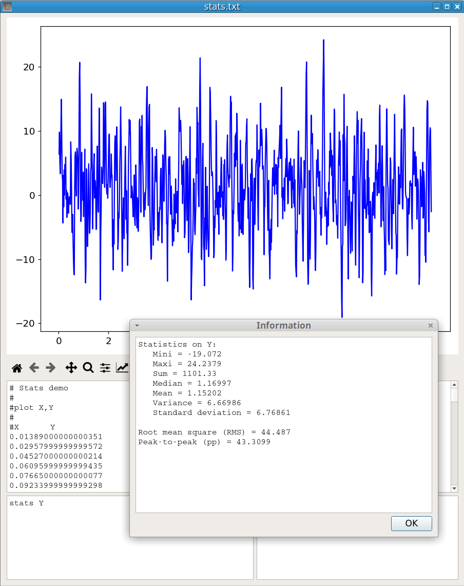{width=500px}


### BET
Brunauer–Emmett–Teller [(BET)](https://en.wikipedia.org/wiki/BET_theory) model serves as the basis for the measurement of the specific surface area of materials from adsorption isotherms. The BET command:

```
BET
```
computes the optimum BET surface area and the BET constant. No parameter is given because it is assumed that the first data block contains the adsorption isotherm with the first vector of this block being the relative pressure and the second vector the adsorbed volume expressed in mL/g. Only nitrogen adsorption is implemented. If the relative pressure reaches the saturation (Pr > 0.98) the BET command computes also the pore volume.
The optimisation process includes finding, in the relative pressure range 0.04 - 0.30, a window of at least seven data points, giving the best correlation coefficient.
The figure 23 shows an example of the computation results. More detailed information is saved in the [log file]().

{width=500px}


### Pore Size Distribution (PSD)
The command *PSD* computes the pore size distribution from adsorption-desorption isotherms. Two data block are  required and it is assumed that the adsorption isotherm is contained in the first data block and the desorption isotherm in a second data block. Moreover, in these blocks, the first vector must contain the relative pressure and the second vector the adsorbed volume expressed in mL/g. Only nitrogen adsorption and cylindrical pore geometry are implemented. 

The *PSD* command takes two parameters. The first, which can be either A or D, indicates which isotherm (A-dsorption or D-esorption) is used. The second parameter specifies the equation used for calculating the thickness of adsorbed layer according to the relative pressure (t-curve). This parameter can have one of the three values: halsey, harkins or tfit.

The figure 24 shows an example of the computation of a PSD. The left plot shows the adsorption-desorption isotherms. The computation was done with the desorption isotherm and halsey curve. At the end of the process a new file is generated which contains four vectors: the pore width (Wp), the pore volume (Vp), the pore volume divided by the pore width difference (dV/dW) and the cumulative pore volume (Vcum). As shown on the right chart, two curves are plotted, the pore size distribution dV/dW and the cumulative pore volume.

{width=700px}


### area
The command:
```
area Y
```
computes the area under a curve Y=f(X) using the [trapezoidal rule](https://en.wikipedia.org/wiki/Trapezoidal_rule). The limits of the integration must be indicated by the marker positions. area is defined by the curve and the x-axis. Thus a baseline correction may be required before the area calculation.
The figure 25 shows an example of the calculation of the area of the last peak. It should be noticed that, in the case of this picture, a better evaluation of the peak area could have been obtained with the [Peak Fitting](#peak-finding-and-peak-fitting) tool.

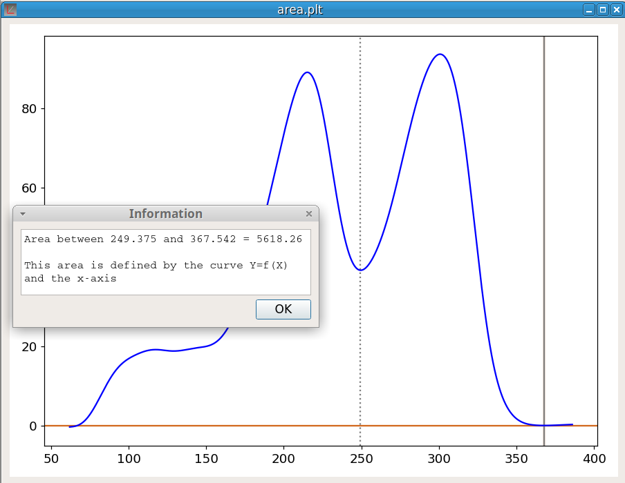{width=500px}


### lineq
The command:
```
lineq Y
```
Compute the equation of the line linking the marker positions on the curve Y. The figure 26 shows an example of utilization.

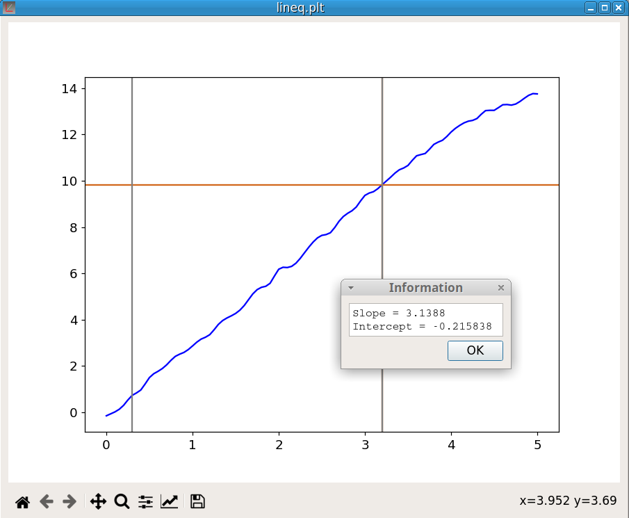{width=500px}


### linefit
The command:
```
linefit Y 1
```
Compute the equation of the line fitting the curve Y at the cursor position. The last parameter, which must be either -1 or +1, indicates the direction of the fitting line.
The algorithm is:

1. Start from the cursor position, in the direction given by the second parameter, and select at least 5 points.
2. Do a linear fitting.
2. Select an additional point in the same direction.
3. If the fitting error exceeds a given limit stop else return to step 2.
The figure 27 shows the result of the calculation.

{width=500px}


### onset
This command is used to determine the onset of a peak. The onset is an important feature of a peak. For example, in thermal analysis, the onset temperature does not depend on the heating rate unlike the temperature of the peak maximum.

Before using the onset command, both markers must be positioned to indicate the beginning and the approximate place of the inflection point at the base of the peak.
The *onset* procedure makes use of the *linefit* function; indeed the process is:

- Call *linfit* with direction = -1 to get the line equation of the baseline at the first marker position.
- Call *linfit* with direction = +1 to get the line equation of the line fitting the peak at the second marker position.
- Calculate the coordinates of the intersection of these two lines. This is the peak onset.

The command is:
```
onset Y
```
The figure 28 shows an example of the calculation.

{width=500px}


## Operations changing all the elements of vectors

### Creating a vector
The command to create a new vector V is:
```
newv Vname Vinit,Vend,stepsiz
```
where *Vname* is the vector name, *Vinit* is the first value, *Vend* is the last value and *stepsiz* is the difference between each value. A new data block is created to contain this new vector. For exemple the command:
```
newv X 0,9,1
```
create a new data block containing the new vector X whose 10 elements are: 0,1,2,3,4,5,6,7,8,9


### Deleting a vector
The command to delete the vector V is:
```
delv V
```

### Exchange the elements between two vectors
The command:
```
swapv V1 V2
```
exchange all the elements between V1 and V2. This commande exchange only the values not the vector names.


### Deleting a data block
The command to delete the data block number n is:
```
delb n
```
This delete all the vectors in the data block. Of course this will delete all the curves which used these vectors.


### Merging data blocks
The syntax of the *mergeb* command is:
```
mergeb 1 2
```
This command copies all the vectors of the block 2 at the end of the block 1 and then delete the block 2. Of course, the vectors must have the same number of elements in both blocks. 


### Scalar operations on a vector

- **V2 = V1 + n** : Add the scalar n to all elements in V1 
- **V2 = V1 - n** : Subtract the scalar n to all elements in V1 
- **V2 = V1 * n** : Multiply all elements in V1 by the scalar n 
- **V2 = V1 / n** : Divide all elements in V1 by the scalar n 

If V2 does not exist, a new variable is created. If V2 preexists, its previous content is lost.

### Operations between vectors

- **V2 = V1** : Copy V1 in V2 (duplicate V1 if V2 does not exist)
- **V1 = V1 + V2** : Add V2 to V1 element-wise 
- **V1 = V1 - V2** : Subtract V2 from V1 element-wise 
- **V1 = V1 * V2** : Element-wise multiplication 
- **V1 = V1 / V2** : Element-wise division


### Applying a function on a vector

The main mathematical functions can be applied to a vector (element-wise). The result is a vector with the same number of elements.

- trigonometric: **sin**, **cos**, **tan**
- inverse trigonometric: **arcsin**, **arccos**, **arctan**
- hyperbolic: **sinh**, **cosh**, **tanh**
- inverse hyperbolic: **arcsinh**, **arccosh**, **arctanh**
- exponential: **exp**
- natural logarithm and base 10 logarithm: **log**, **log10**
- square: **square**
- square root: **sqrt**
- absolute value: **fabs**
- power: **power(V,n)** raises all the elements of V to power n.
- cumulative product: **cumprod(V)** returns the cumulative product of the V elements.
- gradient: **gradient(V)** returns the gradient of the vector V.
- cumulative sum: **cumsum(V)** returns the cumulative sum of the V elements. It has the opposite action of *gradient(V)*.

To illustrate *gradient* and *cumsum* functions, figure 29 shows the result of the execution of the following script sequence:
```
newv X 0,6.28,0.01
Y = sin(X)
dY = gradient(Y)
S = cumsum(dY)
dY_dX = dY/0.01
plot X,Y
plot X,dY_dX
plot X,S
```
Y is the sin(X) function. We see that Y and S curves (the cumsum of gradient) overlap almost perfectly (the shift decreases with dX). dY_dX is the gradient dY divided by dX, namely an approximation of the Y derivative, which is cos(X).

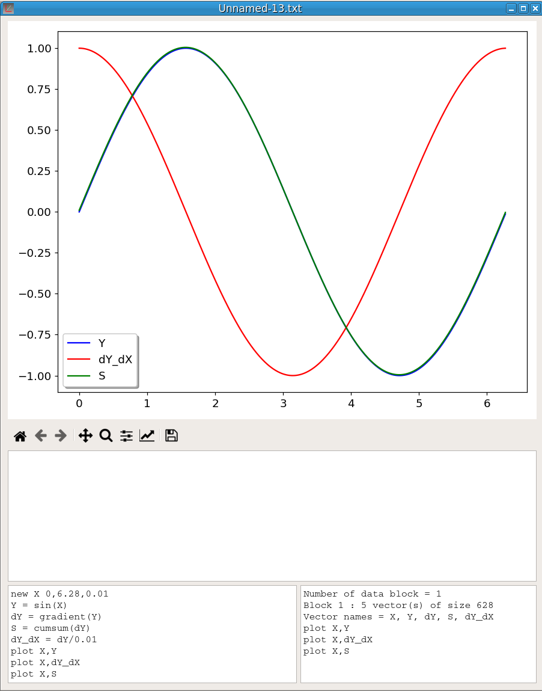{width=500px}


### shrink
This command reduces the number of elements in a vector. It takes two parameters, the vector name and the reducing factor which must be in the range 2-10. This operation implies to reduce the number of elements of all the other vectors in the data block.
For example, the command:
```
shrink V 4
```
reduces in the number of elements in V by a factor 4.


### revert
This command: 
```
revert V
```
will revert the order of elements in V. It takes only one parameter, the vector name. All the vectors belonging to the same data block will have their elements reverted as well.


### sort
This command:
```
sort V
```
will sort the elements of the vector V in ascending order. It takes only one parameter, the vector name. All the vectors belonging to the same data block will have the order of their elements changed but not necessarily sorted.
To sort the vector elements in reverse order, first *sort* V then [*revert*](#revert) V.


### IRabs
This command: 
```
IRabs
```
converts an IR spectrum in absorbance. It takes no parameter. It will generate an error if the first data block does not contain an IR spectrum in transmittance.


### IRtrans
This command:
```
IRtrans
```
converts an IR spectrum in transmittance. It takes no parameter.  It will generate an error if the first data block does not contain an IR spectrum in absorbance.


### fft
This command :
```
fft V
```
computes the [Discrete Fast Fourier Transform](https://en.wikipedia.org/wiki/Fast_Fourier_transform) of a vector. It takes only one parameter, the vector name. The result of the conversion is saved in a file named as XXX-fft.txt where XXX is the vector name.


### despike
This command removes spikes in a vector. It takes two parameters, the vector name and the window size:
```
despike Vname winsiz 
```
The window size corresponds to the width of the spikes in number of points. It must be an odd number. Defaut size is 3. The figure 30 shows an example of use. The blue curve (I) is the original signal and the red curve shows the signal after using the command:
```
despike Ides 3
```

{width=500px}


### delmultx
The command: 
```
delmultx X
```
sorts X in ascending order and then removes duplicates. It processes only the data block containing the vector X. Moreover X must be the first vector of the data block.
This command must be executed before using the [Interpolation tool](#interpolation).


### ndec
This command changes the precision (number of decimal places) of all the vector elements. For example the command:
```
ndec V 5
```
set the precision of all elements of V to 5 decimal places


## Operations changing only a part of vector elements 

### Clipping data
There are four commands for clipping. The commands for clipping along the y-axis are:
```
clipup vname maxval
clipdn vname minval
```
The first replaces in the vector *vname* all elements larger than *maxval* by *maxval*.
The second replaces in the vector *vname* all elements lower than *minval* by *minval*.

The commands for clipping along the x-axis are:
```
clipx < minval
clipx > maxval
```
The first deletes in the vector *vname* all elements lower than *minval*.
The second deletes in the vector *vname* all elements larger than *maxval*.
It should be noted that clipping along y-axis does not change the number of points whereas clipping along x-axis decreases the number of points.

The figure 31 shows an example where the vector Yclip has been obtained by executing the command:
```
Yclip = Y
clipup Yclip 1
clipdn Yclip -1
```

{width=500px}


### line
The *line* command joins, by a straight line, the points of a curve situated at the marker positions. This procedure does not delete the points between the markers but change their position.
```
line Y
```


### shift
The *shift* command shifts vertically the portion of a curve delimited by the markers. For example, the command:
```
shift Y 0.1
```
add 0.1 to the points located between the marker positions. This is illustrated by figure 32.

{width=500px}


## Running Python scripts

The *Execute a Python script* option in the *Script* menu executes the Python script in the *Script window* of the active pyDataVis window. 

pyDataVis does several steps before the execution:
- The vectors of the active curve are saved in the file "input.txt".
- The following Python code is added before the script:
```
import numpy as np
A = np.loadtxt("input.txt")
X = A[0]
Y = A[1]
```
In this way, the vectors of the active curve can be accessed as X and Y.
The output of the Python process is shown in the *Information window* and saved in the file "output.txt".

An application of this option may be to use the powerful [Scipy](https://www.scipy.org/) library to do some tasks not implemented in pyDataVis.
Here is an example of a script using the *curve_fit* function in the *scipy.optimize* module to fit a user defined function to data.
```
import matplotlib.pyplot as plt
from scipy.optimize import curve_fit

def func(x, a, b):
    return a * np.log(-b * np.log(x))

popt, pcov = curve_fit(func, X, Y)

sresult = "Best fit parameters: a={0:g}, b={1:g}".format(popt[0], popt[1])
print (sresult)
plt.plot(X, Y, 'bo')
plt.plot(X, func(X, *popt), 'r-')
plt.suptitle(sresult)
plt.show()
```
The function used to fit the data is: $Y = a \cdot log \left( -b \cdot log(X) \right)$

The figure 33 shows the result of the script execution.

{width=500px}


# Alphabetical list of script commands

- **area** Y : Compute the area under the curve Y. The limits must be indicated by the marker positions. 
- **arrow** x, y, length, angle, b : Draw at x,y a blue arrow of length 40 making an angle of 'angle' with horizontal.
- **BET** : Compute optimum BET surface area and BET constant.
- **clipup** Y maxval : Replace in the vector Y all elements larger than maxval by maxval. 
- **clipdn** Y minval : Replace in the vector Y all elements lower than minval by minval. 
- **clipx** < minval : Delete all elements located below minval in the vector used as abscissa.
- **clipx** > maxval :  Delete all elements located above maxval in the vector used as abscissa.
- **delb b1** : Delete the data block b1.  
- **delv V** : Delete the vector V.
- **delmultx** X: Sort X in ascending order and then remove duplicates. 
- **despike** V winsiz : Removes spikes, which point width are lower than winsiz, in V.
- **labX** Time (s) : Display 'Time (s)' as label of X axis.
- **fft** V : Compute the Discrete Fast Fourier Transform of V.
- **IRabs** : Convert an IR spectrum in absorbance.
- **IRtrans** : Convert an IR spectrum in transmittance.
- **labY1** Rate (rpm) : Display 'Rate (rpm)' as label of Y1 axis.
- **labY2** Intensity : Display 'Intensity' as label of Y2 axis.
- **lineq** V1 : Compute, for curve V1, the equation of the line linking marker positions. 
- **linefit** V1 -1 : Compute the equation of the line fitting the curve V1 at the cursor position. The last parameter, which must be either -1 or +1, indicates the direction of the fitting line.
- **merge b1 b2** : Merge the data blocks b1 and b2 together
- **name** V1 as V2 : Give to the vector V1 the name V2.
- **ndec** V n : Set the number of decimal places to n for all V elements.
- **newv** Vnam Vi, Vf, step : Create a vector whose name is Vnam, first element is Vi, last element Vend and difference between each element is step.
- **nosymbol** Y : Do not draw symbols on the location of data points for the vector Y.
- **onset** V : Determine the onset of a peak. Both markers are used to indicate the baseline and the approximate place of the inflection.
- **plot** X,Y : Plot Y against X. Each curve require a separate plot command.
- **plot** X,Y,2 : Plot Y against X using a secondary Y axis.
- **revert** V : Revert the order of elements in V.
- **shift** Y v: Add the value v to the portion of Y curve delimited by the markers.
- **shrink** V n : Reduce in the number of elements in V by a factor n.
- **stats** V : Return statistics on V.
- **sort** V : Sort the elements of the vector V in ascending order.
- **swapv V1 V2** : Exchange all the elements between vectors V1 and V2. Does not change the names.
- **text** x, y, title, r, 14 : Write 'title' at x,y using a red font with size 14.
- **symbol** Y : Draw symbols on the location of data points for the vector Y.


# Alphabetical list of keyboard shortcuts

- **Ctrl+Shift+B** : Duplicate a curve.
- **Ctrl+Shift+C** : Copy a curve in memory.
- **Ctrl+Shift+D** : Delete a curve.
- **Ctrl+D** : Move the cursor to the next curve.
- **Ctrl+F** : Move the cursor to the first point.
- **Ctrl+L** : Move the cursor to the last point.
- **Ctrl+LArrow** : Move the cursor to the previous point.
- **Crtl+M** : Set a marker at cursor position.
- **Ctrl+N** : Create a new empty pyDataVis window.
- **Ctrl+O** : Open a file.
- **Crtl+Q** : Quit the pyDataVis application.
- **Crtl+R** : Remove all the markers cursor included.
- **Ctrl+RArrow** : Move the cursor to the next point.
- **Ctrl+S** : Save to file the data in active window.
- **Ctrl+Shift+S** : Save the data in active window in a file, using a new filename.
- **Ctrl+T** : Show the data table.
- **Ctrl+U** : Move the cursor to the previous curve.
- **Ctrl+Shift+V** : Paste the curve stored in memory.
- **Ctrl+Shift+X** : Copy a curve in memory then delete it.
